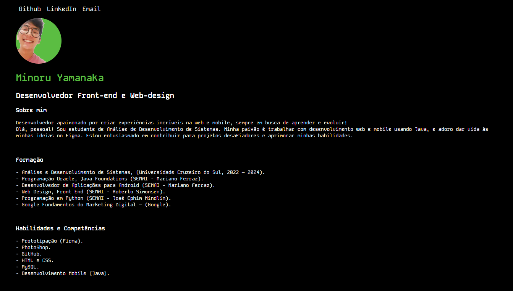

# [Portfólio  | Currículo](https://minoru-yamanaka.github.io/cv/)

## Descrição
Este é o código-fonte de um portfólio pessoal, que inclui informações sobre educação, habilidades, interesses e experiência profissional de Minoru Yamanaka.

## Tecnologias Utilizadas
- HTML5
- CSS3
- Google Fonts
- Git Pages

## Estrutura do Projeto
O projeto está organizado em arquivos HTML e CSS. A estrutura é a seguinte:

- **index.html**: Página inicial que contém informações pessoais, como foto, nome, habilidades, formação e interesses.
- **index.css**: Arquivo CSS que estiliza a página inicial.
- **img**: Pasta contendo imagem utilizada no projeto.

## Instruções de Uso
1. Faça o clone ou download do repositório.
2. Abra o arquivo index.html em um navegador da web para visualizar o portfólio.

## Personalização
Você pode personalizar o portfólio da seguinte maneira:
- Alterando as informações pessoais no arquivo index.html.
- Personalizando o estilo no arquivo index.css.

## Autor
Minoru Yamanaka - [GitHub](https://github.com/Minoru-Yamanaka) | [LinkedIn](https://www.linkedin.com/in/minoru-yamanaka/)

## Licença
Este projeto está sob a licença MIT. Consulte o arquivo LICENSE para obter mais detalhes.
